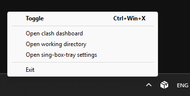

# sing-box-tray

A Python script that adds a tray icon for [sing-box](https://github.com/SagerNet/sing-box).

## Features



- Click on the icon to turn it on/off
- Keyboard shortcut to turn it on/off
- Some shortcuts in the menu
- Customizable icon (for both the on and off states)
- Supports Windows, MacOS and Linux[^1]

[^1]: Hasn't been tested on Linux and MacOS but it should probably work.

## Usage

First, install [sing-box](https://github.com/SagerNet/sing-box). Then create a virtual environment and install dependencies:

Windows:

```powershell
python -m venv venv
.\venv\scripts\activate
pip install -r requirements.txt
```

Linux:

```bash
python3 -m venv venv
source ./venv/bin/activate
pip install -r requirements.txt
```

Now run the `sing-box-tray.py` file with Python:

```
python sing-box-tray.py
```

Alternatively, you can bundle the script into an executable file with `pyinstaller`. Build it either with this command:

```
pyinstaller --noconsole --onefile --icon=icon.ico --add-data "icon_base.png:." --add-data "sb_tray_config.dist.json:." sing-box-tray.py
```

Or with the `.spec` file:

```
pyinstaller sing-box-tray.spec
```

Then you can run the file in `dist` directory.

> [!WARNING]
>
> Currently you can get sing-box logs only using an [output file](https://sing-box.sagernet.org/configuration/log/#output) or the Clash dashboard. So if sing-box doesn't work, it is probably due to a missing config file or insufficient privileges. Don't forget to check the fields in [sing-box-tray config file](#Config) (especially `sing_box_path` and `sing_box_config_path`) or run the program with elevated privileges.

## Config

All settings are stored in the `sb_tray_config.json` file in the same directory as the program.

- `sing_box_path` - the path to the sing-box executable. If its value is `sing-box` or an empty string, sing-box must be in the PATH variable
- `sing_box_config_path` - the path to the sing-box configuration file. `<sb-tray-dir>/config.json` if left empty
- `sing_box_workdir` - the path to sing-box working directory. `<sb-tray-dir>/sb_workdir/` if left empty
- `clash_dashboard_url` - the URL of your Clash dashboard. The button in the menu won't show up if left empty
- `icon_on_rgba` - the RGBA color for the turned-on icon
- `icon_off_rgba` - the RGBA color for the turned-off icon
- `keybind` - the keyboard shortcut to turn it on/off (example: `ctrl+win+x`). There will be no shortcut if left empty
- `default` - if set to `true`, sing-box will be turned on automatically when sing-box-tray starts